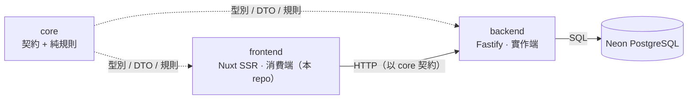
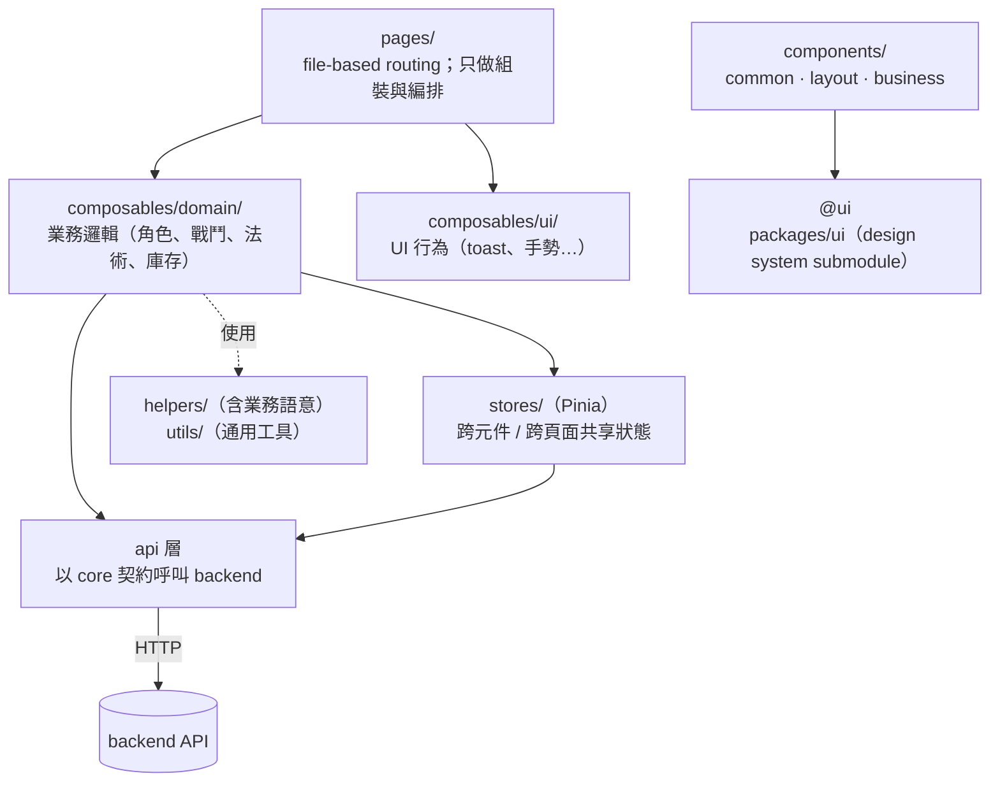

# Rolling Dice — Frontend

D&D 5e 角色卡管理系統的**契約消費端**。
Nuxt 4 + Vue 3 + TypeScript，**SSR 模式部署於 Vercel**（Nitro `vercel` preset）。

負責 render、使用者互動與呼叫 backend；持久型別不在這裡定義——一律 import 自共享套件 `@rolling-dice-app/core`。UI 元件來自 `packages/ui`（git submodule 的 design system）。

> 完整內部技術約定見 `CLAUDE.md` 與 `.claude/skills/`；本檔聚焦於架構概覽與開發流程。

## 在整個產品中的位置

這是一個三 repo 產品。`core` 定義「共享領域語言」（型別 + 純規則），`backend` 實作 API、`frontend` 消費 API：



- **本 repo owns**：render、導航、互動、表單與 UI 狀態、API 呼叫的編排。
- **不碰**：持久型別與 DTO 不在這裡重新宣告——要改型別走 `core` repo；資料權威在 backend。

## 技術棧與選型理由

| 技術                                          | 角色          | 為什麼選它                                                                                                |
| --------------------------------------------- | ------------- | --------------------------------------------------------------------------------------------------------- |
| **Nuxt 4 + Vue 3**                            | 框架          | SSR（首屏 + SEO）、file-based routing、auto-import；`<script setup lang="ts">` 為預設。                   |
| **Pinia**                                     | 共享狀態      | 只放真正跨元件 / 跨頁面的狀態（auth、character、inventory、spells、navigation）；一次性頁面狀態留 local。 |
| **Tailwind v4**                               | 樣式          | utility-first + `@theme` token 分層（`--rui-*` design-system token vs `--rd-*` app token）。              |
| **`@rolling-dice-app/core`**                  | 共享契約      | 持久型別、DTO、列舉的單一來源；前端不本地重宣告。                                                         |
| **`packages/ui`**（submodule）+ **Storybook** | design system | 20+ 可複用 Vue 元件，獨立 dev / build / CI / deploy，app 經 `@ui` alias 只消費不修改。                    |
| **oxlint + eslint**（雙 pass）                | lint          | oxlint 快速第一道、eslint（`@nuxt/eslint`）完整第二道；commit 時 lint-staged 自動跑。                     |
| **Vitest + @vue/test-utils**                  | 測試          | unit + component 測試，coverage 門檻 80%。                                                                |

## 架構：分層職責



職責邊界（細節見 `CLAUDE.md`）：

- **`helpers/` vs `utils/`**：`helpers/` 帶 D&D 業務語意（規則計算、分級判斷）；`utils/` 為通用工具（debounce、字串、storage 封裝）。
- **`composables/domain` vs `ui`**：前者業務邏輯，後者 UI 行為。
- **`stores/`**：只放跨頁共享狀態，不把一次性頁面 UI 狀態升級成全域。
- **`components/{common,layout,business}`**：`business/` 放領域專屬元件，其餘為通用。

## 第一次 clone 後的設定

```sh
pnpm install   # 安裝依賴，並自動設定 git hooks
pnpm init:ui   # 初始化 UI submodule、安裝依賴、打包
pnpm dev       # 啟動開發伺服器 http://localhost:3000
```

> `pnpm install` 會透過 `prepare` script 設定 `core.hooksPath .githooks`，之後的 git hooks 才會生效。
> 未執行 `pnpm init:ui` 時，`@ui` alias 指向尚未產出的 `packages/ui/dist/`，dev / build 會失敗。

## 日常開發

```sh
pnpm dev        # 開發伺服器
pnpm update:ui  # 更新並重新打包 UI submodule
```

## 型別檢查 / Lint / Format

```sh
pnpm type-check    # nuxi typecheck
pnpm lint          # oxlint --fix → eslint --fix
pnpm lint:check    # 僅檢查不修改
pnpm format        # prettier --write
```

> commit 時 `lint-staged` 會自動跑 oxlint → eslint → prettier，請勿用 `--no-verify` 繞過。

## 測試

```sh
pnpm test:unit       # vitest（watch 模式）
pnpm test:unit:ci    # vitest --run（單次）
pnpm test:coverage   # 覆蓋率報告（門檻 80%）
```

執行單一測試檔：`pnpm test:unit app/tests/unit/stores/character.spec.ts`
依測試名稱過濾：`pnpm test:unit -t "部分名稱"`

## 建置與部署

```sh
pnpm build     # SSR 主建置（Nitro vercel preset 輸出）
pnpm generate  # SSG 靜態產出 —— 僅供凍結的 GitHub Pages demo，非主部署路徑
pnpm preview   # 預覽建置產出
```

正式產品以 **SSR 模式部署於 Vercel**（`nuxt.config.ts` 設 `ssr: true`、`nitro.preset: 'vercel'`）。
base URL 由 `NUXT_APP_BASE_URL` 控制（Vercel = `/`）。push 觸發 Vercel 自動建置部署。
GitHub Pages 上的 `pnpm generate` 靜態 demo 是更早期建置的凍結快照，已非主要目標。

## 專案結構

```
rolling-dice/
├─ app/                # Nuxt 應用（主產品）
├─ packages/ui/        # Vue 元件庫 / design system（git submodule）
├─ docs/               # 設計規格與 review 紀錄
├─ .claude/skills/     # Claude Code 用的領域規範
├─ nuxt.config.ts
└─ package.json
```

> 這是 pnpm workspace：`app/`（Nuxt 應用）與 `packages/ui/`（獨立 build pipeline 的元件庫）。app 經 `@ui` alias 消費 UI 庫，**不修改其內部**——自訂落在 `app/components/`。

### app/ 主要目錄

| 目錄                  | 用途                                                          |
| --------------------- | ------------------------------------------------------------- |
| `components/`         | Vue 元件（`common` / `layout` / `business`）                  |
| `composables/domain/` | 業務領域 composable（角色、戰鬥、法術、庫存等）               |
| `composables/ui/`     | UI 行為 composable（toast、手勢等）                           |
| `helpers/`            | 含業務語意的純函式（規則計算、分級判斷）；Nuxt auto-import    |
| `utils/`              | 不含業務語意的通用工具（debounce、字串、localStorage 封裝等） |
| `stores/`             | Pinia 跨元件 / 跨頁面共享狀態                                 |
| `pages/`              | Nuxt file-based routing；只負責組裝與 orchestration           |
| `layouts/`            | Nuxt 版面                                                     |
| `types/`              | Domain type，分 `business` / `common` / `layout`              |
| `constants/`          | 常數（規則表、列舉等）                                        |
| `mocks/`              | 測試與開發用 mock 資料                                        |
| `tests/`              | Vitest 測試（非 colocated，集中於 `app/tests/**/*.spec.ts`）  |

詳細開發規範與分層原則請參考根目錄 `CLAUDE.md` 與 `.claude/skills/`。
